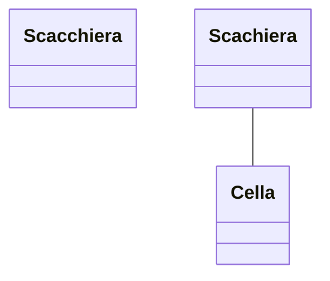

# demo3
Repository per l'esercitazione su GitHub Flow del corso di IngSoft 2020/2021 

## Modello di dominio per il gioco degli scacchi

Questo è un esempio di uso di **Mermaid**

```mermaid
classDiagram
class Scacchiera
Scachiera -- Cella
```
